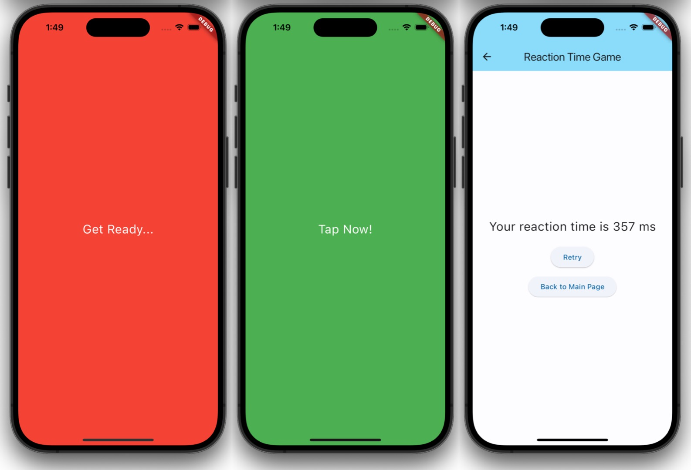
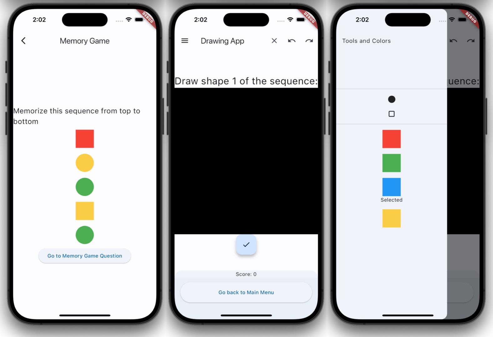
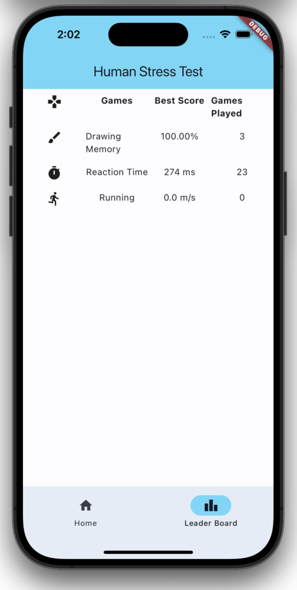

# Human Stress Test Game

This project is a **Human Stress Test Game** designed to assess a variety of cognitive and motor skills under pressure. It features multiple interactive games that challenge users in areas such as reaction time, memory retention, and hand-eye coordination through drawing tasks. By engaging users in these tests, the game provides a fun and engaging way to measure how well individuals respond to different stress-inducing situations.

## Features

-   **Reaction Time Game**: Accurately measures how quickly users can respond to visual or auditory stimuli. The faster you respond, the higher your score.
-   **Memory Game (with Drawing Area)**: Tests your ability to recall a sequence of shapes and colors. It features a drawing area where you can replicate the sequence, with **redo** and **undo** options to correct mistakes. This game challenges both memory and fine motor skills.

-   **Running Game**: A fast-paced game that requires quick reactions to navigate obstacles. This game measures both speed and endurance as the difficulty increases over time.

-   **Leader Board**: Tracks the top players across all games and displays scores in real-time. Players can compete for the highest scores in reaction time, memory accuracy, and running performance.

-   **Detailed Scoring System**: Provides detailed feedback on each player's performance, including reaction times, memory recall accuracy, and overall scores across the different games.

## File Overview

### Core Game Files

-   `main.dart`: The main entry point for the Flutter app. It initializes the game and manages the overall flow.
-   `reaction_time_game_model.dart`: Contains the logic for the reaction time game, including tracking and scoring.
-   `memory_game.dart`: Implements the memory game logic, including sequence generation and validation.
-   `drawing.dart`: Manages the drawing area where users can draw shapes like rectangles, ovals, triangles, and lines.
-   `running_game_page.dart`: A dedicated page to handle the visual and logical aspects of the running game.

### Actions

-   `clear_action.dart`: Clears the current drawing canvas.
-   `null_action.dart`: A placeholder action when no user action is taken.
-   `oval_action.dart`, `rectangle_action.dart`, `triangle_action.dart`, `line_action.dart`: Handle shape-drawing actions.
-   `stroke_action.dart`: Manages drawing strokes for the various shapes and lines.
-   `text_action.dart`: Allows users to add text to their drawings.

### Providers

-   `drawing_provider.dart`: State management for the drawing area.
-   `memory_game_provider.dart`: Manages the state for the memory game.
-   `position_provider.dart`: Tracks the position records for accuracy during games.
-   `reaction_time_game_provider.dart`: Handles the logic and state for the reaction time game.

### Scoring and Records

-   `reaction_time_records.dart`, `reaction_time_record_entry.dart`, `reaction_time_record_entry.g.dart`: Manage reaction time data records.
-   `drawing_memory_records.dart`, `drawing_memory_record_entry.dart`, `drawing_memory_record_entry.g.dart`: Handle memory and drawing record keeping.
-   `position_records.dart`, `position_record_entry.dart`, `position_record_entry.g.dart`: Manage position data for user actions.
-   `scores_mocker.dart`: Mocked scoring data for testing the leader board.
-   `leader_board.dart`: Displays top scores in the game.

### Views

-   `memory_game_question_view.dart`, `memory_game_result_view.dart`, `memory_game_view.dart`: Components for displaying memory game questions, results, and the main view.
-   `reaction_time_game_page.dart`: The UI page where users play the reaction time game.
-   `reaction_time_game_result_page.dart`: Displays results for the reaction time game.

### Utilities

-   `tools.dart`: General utility functions and tools used across the game.
-   `uuid_maker.dart`: Generates unique IDs for game sessions or players.
-   `palette.dart`: Manages colors and drawing tools available in the drawing area.
-   `draw_area.dart`, `drawing_painter.dart`: Handle the actual drawing mechanics and rendering.

## Game Interface Screens

Here are the key game interface screens with corresponding screenshots:

1.  **Reaction Time Game**:

    -   A visual or auditory signal appears, and users need to react quickly.
          <p align="left">
          
          </p>

2.  **Memory and Drawing Game**:

    -   A sequence of shapes and colors is displayed, and users need to memorize and replicate the sequence using the drawing area.
    -   Three screenshots are displayed side by side showing different stages of the memory and drawing process.
          <p align="left">
          
          </p>

3.  **Leaderboard**:

    -   Displays the top scores across all games, ranking players by their performance.

        <p align="left">
        
        </p>

## Installation

### Prerequisites

-   Ensure that [Flutter](https://flutter.dev/docs/get-started/install) and [CocoaPods](https://guides.cocoapods.org/using/getting-started.html) are installed and set up on your machine.
-   Clone this repository:

    ```bash
    git clone <repository-url>
    cd <repository-name>
    ```

-   Install dependencies:
    ```bash
    flutter pub get
    cd ios
    pod install
    cd ..
    ```

### Running the Application

To run the app on your local device or emulator:

```bash
flutter run
```

Ensure you have an emulator running or a physical device connected.

## How to Play

1. **Reaction Time Game**:

    - A visual or auditory signal will be shown.
    - Your task is to tap as quickly as possible when the signal appears.
    - Your reaction time will be accurately measured and displayed at the end of the test.

2. **Memory Game** (includes Drawing Area):

    - A sequence of shapes with different colors will be shown.
    - You need to recall and redraw the sequence of shapes in the correct order and color.
    - The game includes **redo** and **undo** functions to help you correct mistakes during drawing.
    - Your score is based on how accurately and quickly you can replicate the sequence.

3. **Running Game**:

    - This game tests your ability to control a character running through obstacles.
    - You will need to jump or duck to avoid obstacles while running.
    - The game measures both your reaction time and endurance, and the score reflects your performance over time.

4. **Leaderboard**:
    - The leaderboard displays the top scores across all games.
    - You can compete with other players to achieve the best score in reaction time, memory recall, and the running game.
    - Scores are updated in real-time, allowing you to track your progress.

## Contributors

-   Charyl Li
-   Benjamin So
-   Steven Tang
-   Amy Cheng
-   Ramses Lee
